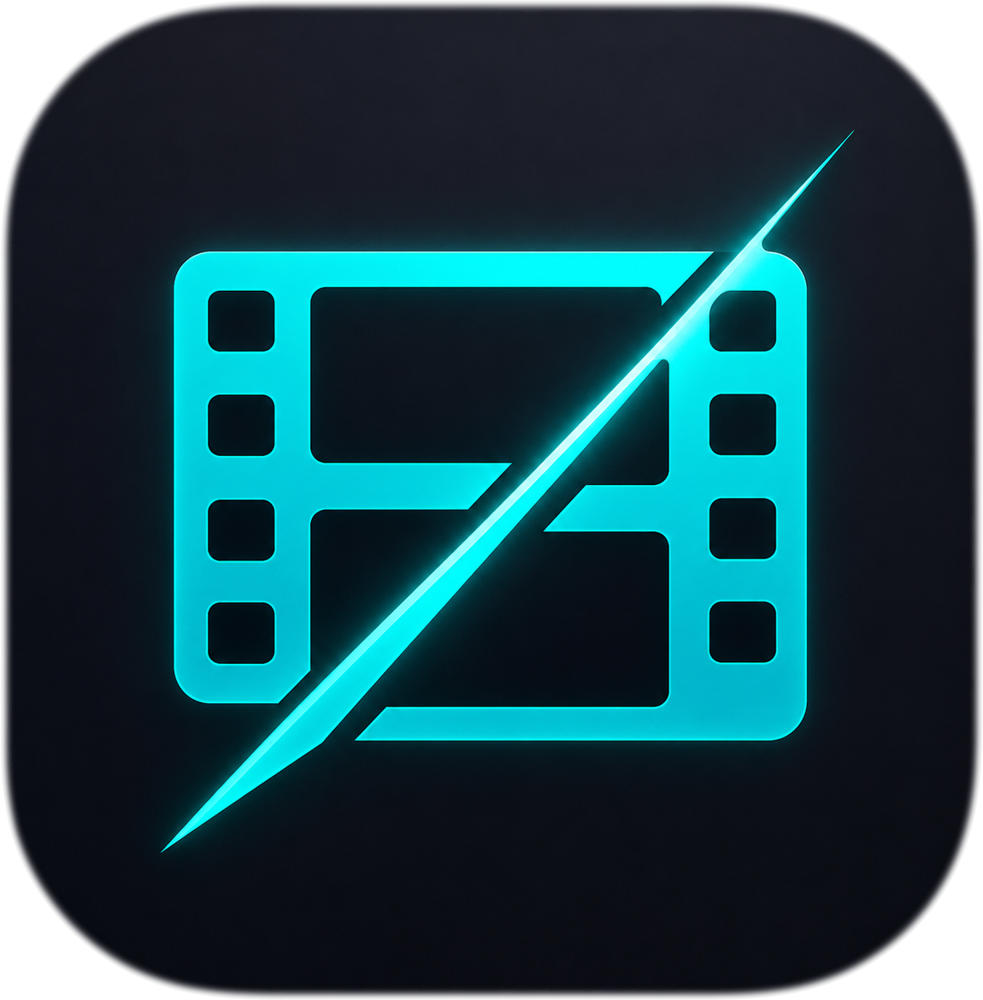
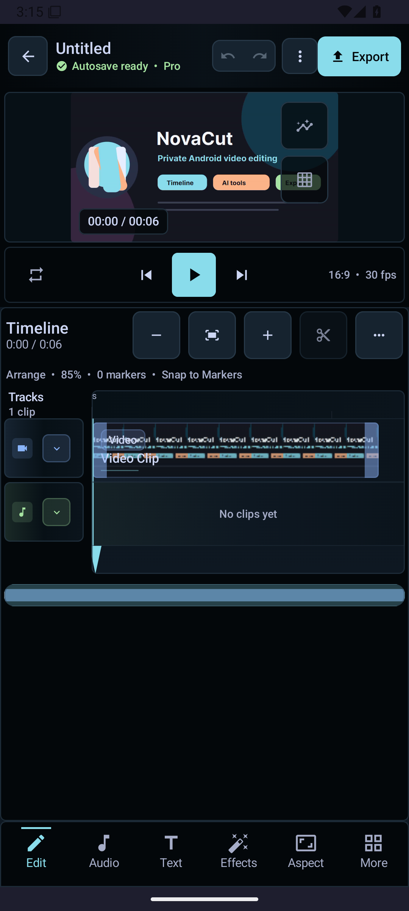

<p align="center">
  
</p>

<h1 align="center">ClearCut</h1>

[](https://github.com/SysAdminDoc/ClearCut/releases)
[](LICENSE)


### v3.74.142 Smart Reframe model repair

- Repinned the BlazeFace face-detector model to its generation-locked URL, exact 229,746-byte ceiling, and correct SHA-256, so Smart Reframe can reach a verified ready state instead of failing the byte/checksum guard.
- Added the model to the `docs/models.md` registry and changed the registry coverage test to discover every runtime `ModelFile` download spec, so any new engine that skips checksum verification fails the build.

### v3.74.141 Consent-gated MediaPipe

- On-device MediaPipe tasks (selfie segmentation, Smart Reframe) are now gated by explicit, versioned consent. No `ImageSegmenter`/`FaceDetector` is constructed before the user opts in from Settings → AI Models.
- Revoking consent closes any running task and blocks it from starting again until re-consent; all non-MediaPipe editing stays fully usable when denied.
- The privacy dashboard, policy, and Play Data safety worksheet now disclose that the MediaPipe SDK sends anonymous performance metrics to Google via Play Services DataTransport while input media stays on-device. A source-scan test proves every Tasks constructor call site is gated.

### v3.74.140 Trustworthy saved-state tracking

- The editor now compares a canonical document fingerprint with the latest completed save, so new edits show as unsaved and undoing exactly to the saved baseline clears the modified state.
- Manual and periodic saves carry ordered snapshot tokens; edits made during a save and stale success/failure callbacks can no longer be mislabeled as current persistence.
- Autosave errors remain visible until a successful retry. Fingerprints ignore timestamps, playhead position, proxy paths, media verification refreshes, and map/set iteration order while retaining every persisted edit domain.
- Undo snapshots now restore global transitions, storyboard cards, and transcripts, allowing those edits to return to the same clean baseline.

### v3.74.139 Frame-quantized timeline edits

- Project timing now uses a persisted rational timebase with deterministic NTSC frame conversion; new splits, trims, slips, slides, ripple deletes, markers, chapters, and explicit seeks resolve on project-frame boundaries.
- Linked edits carry frame deltas instead of rounded millisecond deltas, preventing 29.97 fps drift such as 67 ms becoming 66 ms after a ripple or linked positions shifting to 134 ms instead of 133 ms.
- Preview and project cards show resolved frame-rate/timecode labels. Room schema 9 and template interchange preserve the rational timebase while leaving legacy timeline data unchanged until edited.

### v3.74.138 Transactional timeline gestures

- Trim, slip, and slide now capture their pre-edit undo snapshot only before the first effective timing change, keeping undo and redo byte-for-byte unchanged for taps, clamped drags, and other no-ops.
- Pointer cancellation restores the pre-gesture tracks, selection, and playhead without committing history; a drag that returns to its original timing also adds no undo entry.
- Successful gestures still commit exactly one history entry at gesture end, clear redo only then, and rebuild/persist once. Timing-signature comparisons avoid Android `Uri` equality affecting no-op detection.

### v3.74.137 Live extended-trim preview

- Dragging either trim edge now keeps direct seeks for retained media and throttles composition refreshes only when the gesture exposes media outside the range prepared at gesture start.
- Pending trim refreshes are canceled before the final gesture rebuild, while an immutable prepared-range snapshot keeps extend/retract/re-extend sequences correct without rebuilding on every pointer event.
- Media3 preview items now declare original source duration before clipping, fixing non-zero trim starts that were rejected before decode. A physical-device two-color H.264 fixture verifies both the trimmed and newly exposed boundary frames.
- A clean lint rebuild reproduced the same Kotlin analysis API crash in `UnrememberedMutableState`; it joins the exact per-detector workaround/probe set until the pinned analysis stack changes.

### v3.74.136 Multi-track live composition

- Live preview now uses Media3 `CompositionPlayer` with one synchronized composition for every visible video/overlay lane and every audible dedicated audio lane.
- Preview and export share persisted track ordering, absolute sequence gaps, mute/solo/volume policy, linked-audio suppression, clip speed, fades, and volume automation; composition rebuilds preserve the playhead and requested playback state.
- Missing upper layers become transparent sequence gaps instead of black frames that hide lower video. Proxy resolution, preview-safe effects, adjustment layers, and color-blind simulation remain in the composition graph.
- Physical-device offscreen integration proves two simultaneous visual sequences composite with the expected z-order/opacity, seek together, and accept a gap-only replacement graph; pure tests cover overlap ordering, gaps, visibility, mute, solo, gain, and sampled speed changes.
- Clean lint analysis proved `RememberInComposition`, `AutoboxingStateCreation`, and `UnrememberedMutableState` crash against the pinned Kotlin analysis API; all remain in the exact re-probeable workaround set.

### v3.74.135 Shaped CJK and RTL captions

- Caption preview keeps highlighted Arabic/mixed text in one bidi-shaped paragraph, resolves CJK/Arabic system fallback families, and reveals typewriter text only at grapheme boundaries.
- ASS burn-in now preserves Unicode and caption styling with per-script Noto families from Android system fonts; requested burn-in failures stop the export instead of silently shipping an uncaptioned video.
- Media3 text overlays use glyph-aware fallback, while stroked overlays use `StaticLayout` for shaping, bidi, wrapping, and bounds. JVM/native-graphics fixtures cover CJK, Japanese, Korean, Arabic, mixed direction, supplementary RTL, combining marks, and emoji ZWJ sequences.

### v3.74.134 Complete semantic feature theming

- Editor, export, and media-picker features no longer read raw palette tokens: structural text/panels/surfaces/strokes/indicators now follow the active semantic palette, while category identity uses one audited accent contract.
- High Contrast Dark now reaches custom timeline, preview, curve, mask, mixer, scope, and transform surfaces; contrast tests cover every semantic elevation and category accent, and a source ratchet prevents raw-token regressions.
- Added an instrumentation render smoke for High Contrast Dark across phone editor/media/export and forced desktop editor/export, with accessibility checks and captured roots at both layouts.

### v3.74.133 Narrow lint workarounds

- Independently re-tested every disabled Compose/lifecycle source detector and restored `RememberInComposition`, `AutoboxingStateCreation`, and `UnrememberedMutableState` across main, unit-test, and Android-test analysis.
- The three remaining binary-incompatible detectors have exact current failure evidence, an opt-in per-detector Gradle probe, and a dependency-version ratchet that forces review after AGP, Kotlin, Compose, or lifecycle upgrades.

### v3.74.132 Locale and accessibility parity

- English and Spanish resource keys, plural quantities, and format placeholders now have a strict parity ratchet; the export, timeline, speed-curve, and mask surfaces no longer expose reachable English-only copy or enum labels.
- Debug builds generate and register expanded en-XA and RTL ar-XB pseudo-locales, with an instrumentation smoke that renders the critical export flow, runs accessibility checks, captures both layouts, and verifies RTL direction.
- Mask toggles now present one switch action with a localized state description, while export column choices use locale-aware plurals.

### v3.74.131 Minimal normal-build permissions

- Normal debug/release APKs no longer declare dormant Nearby or local-network permissions, and the streaming engine is compile-time disabled even if an incidental backend class appears.
- A side-by-side `streaming` preview variant alone carries the future Android 16/17 permission/rationale contract; merged-manifest, policy, privacy, and Play-listing validators lock the split.

### v3.74.130 Storage-safe exports

- Every export checks destination and scratch capacity before dispatch, then checks again immediately before stream copy, each Transformer run, mixed concat, and frame capture.
- The planner merges same-volume demand, accounts for retained reverse/mixed/burn files and complete batches, blocks unbounded sizes, and reports localized required/available values with smaller alternatives.

### v3.74.129 Reproducible native video stack

- Replaced the obsolete binary fork with a source-pinned FFmpegKitNext 8.1.0 / FFmpeg 8.1.2 GPL build across five Android targets; AVI processing is restored on the fixed decoder.
- Release preflight verifies the vendored AAR, exact source/build lock and advisory review, then emits deterministic CycloneDX 1.6 and SPDX 2.3 native inventories.

### v3.74.128 Bounded model downloads

- Every downloadable model now declares a hard byte ceiling in addition to its minimum, estimate, and checksum.
- Oversized declared lengths fail before body reads; chunked or lying responses abort before writing past the cap, delete partial files, preserve storage headroom, and keep progress bounded.

### v3.74.127 Portable projects and review-first Auto Edit

- `.clearcut` archives now carry a typed v2 dependency manifest with safe paths, byte lengths, SHA-256 integrity, LUT/custom-font/watermark packaging, verified import rewrites, tamper rejection, and v1 compatibility.
- Auto Edit scores bounded windows throughout each source and exposes deterministic Highlight, Source Order, and Beat Sync proposals for review; generation and cancellation are non-mutating, while Apply is one undoable edit with stale-source protection.
- Android 16 strict intent matching now rejects null or mismatched explicit intents while preserving launcher, shortcut, VIEW, SEND, and SEND_MULTIPLE entry points.

### v3.74.126 Dependency-truthful export preflight

- Export now resolves one typed dependency manifest before every render path, recursively covering timeline media, compound clips, LUTs, custom fonts, configured watermarks, and the background-removal model.
- Missing, unreadable, or invalid requested dependencies block before output work starts and are named in the error; a substitution can proceed only when an explicit fallback and its name are recorded.
- Added deterministic collector/probe and combined media/audio/dependency preflight tests. Storyboard-only assets remain portable without blocking timeline export.

### v3.74.125 Private diagnostic sharing

- Diagnostic ZIPs now group export incidents with bundle-scoped project pseudonyms and structured failure/configuration counts only.
- Project names and IDs, media paths, free-form error text, health summaries, captions, and transcripts remain available only in private on-device incident history and never enter the shared ZIP.
- Hostile-string regression coverage scans every generated ZIP entry, and dependency verification now trusts the independently verified JUnit 5.9.2 module metadata used by clean test builds.

### v3.74.120 Editor workspace and playback

- Replaced oversized multi-row tool cards with a compact action rail; Color and FX now open their real editors directly, and tool panels use title-only headers without training copy.
- Removed automatic tutorials and editing-suggestion banners from the editing workspace so the preview, timeline, and commands remain uninterrupted.
- Added a persistent Text lane above video for new and restored projects. Text spans render on the lane, tap to edit, and empty lane space opens a new title.
- Compact phone timelines use tighter chrome, shorter rulers, concise track labels, and a collapsed Text lane to return vertical room to the video preview.
- Paused Media3 sessions stuck in `BUFFERING` now restart before Play, and the preview no longer shows a permanent loading spinner when playback was not requested.
- The project home now opens directly on compact create/import, search, filters, and recent work instead of a marketing/training hero.
- Playback completion retains the final decoded frame instead of misclassifying the exact timeline end as an empty gap.

### v3.74.119 Timeline edit controls and playback

- The video preview now owns all flexible phone height; the bounded timeline and tool dock stay together at the bottom instead of leaving a large empty timeline panel.
- Cut works directly at the live playhead, selected clips expose an obvious red Delete button, playlist rebuilds start atomically at the active edit point, ripple deletes keep playback attached to surviving content, and Play restarts after reaching the edited timeline end.
- Autosaves restore silently without interrupting editing with a confirmation popup.
- Autosave status now changes to Saved only after the file write succeeds; failed periodic, immediate, or database writes remain visible as an inline error without a popup.
- Release signing now resolves both property and environment keystore paths from the repository root, preventing a valid root-level keystore from silently producing a debug-signed APK.
- Editing suggestions now offer “Not now” and remain snoozed for 30 minutes instead of reappearing on each clip selection.
- Manual cuts keep the prepared Media3 timeline intact, stored player listeners attach during lazy player creation, and Play re-seeks/restarts correctly after cuts and timeline end.
- Merging adjacent cuts keeps every later clip at its existing timeline position instead of shifting the rest of the track backward into an overlap.
- Playback intent now remains distinct from decoded-frame progress, so buffering after a cut shows Pause and cannot turn a visible Play tap into an accidental cancellation.
- Ended or stalled preview sessions reset their media period and decoder at the active timeline position, with an automatic one-shot recovery when playback does not begin promptly.
- Saved transitions remain active for export, while the live preview uses stable cuts instead of unsafe single-input transition shaders that could leave Media3 on a black frame after rewind.
- Effect safety now includes true alpha opacity, wired chroma spill, tail-aware nonlinear transition timing, corrected gamma/highlight/shadow/posterize math, and guarded GPU edge cases; unsupported generic Speed/Reverse/BG Removal entries are no longer offered as no-op effects.
- Easy mode now maps to the current editor tabs, the More workbench exposes rendered motion tools, clip-only captions are no longer offered without a clip, and the command palette routes background replacement, face tracking, and frame interpolation correctly.
- Incomplete mask/blend compositing and unrendered audio pan/FX controls are withheld from the editor instead of accepting edits that preview or export cannot honor.
- The preview PlayerView remains mounted across timeline gaps, still images, and error overlays, preventing Samsung/Qualcomm surface-detach timeouts from being mislabeled as clip decoder failures.
- Playback recovery now verifies actual timeline movement instead of trusting Media3's `isPlaying` flag; a stuck-player signal at the timeline end is handled as normal completion rather than a decode error.
- Adjacent plain cuts from the same source are coalesced only in the Media3 preview playlist, preventing a hardware-decoder restart at the cut while keeping the timeline clips independently editable.

<p align="center">A professional Android video editor built with Kotlin and Jetpack Compose.<br>Open alternative to CapCut, PowerDirector, and DaVinci Resolve — with AI-assisted tools, GPU-accelerated effects, and desktop NLE interoperability.</p>


Release history is maintained in git tags and the development checkout's local
`CHANGELOG.md`.

## Premium mobile workspace

The phone-first editing workspace keeps the footage, frame transport, and
multi-track timeline in one continuous AMOLED editing deck. Saved state stays
with the project identity, track controls remain compact, and a six-category
tool dock keeps advanced actions available without turning the canvas into a
dashboard.

<p align="center">
  
</p>

## Project planning

Planning files are local-only in the development checkout:

- `ROADMAP.md` is the only source of truth for incomplete actionable work.
- `Roadmap_Blocked.md` records blocked or operator-gated work until it can be
  implemented locally.
- `RESEARCH.md` stores consolidated product, platform, and ecosystem research.
- Shipped work lives in git history and the local `CHANGELOG.md`.

## Features

### Languages
- English and Spanish (`es`) are available through Android 13+ per-app language settings.

### Timeline Editing
- Multi-track timeline with video, audio, overlay, text, and adjustment layers
- Trim, split, merge, crop, rotate with visual handles; numeric trim commits as one undoable edit
- **Reliable split ownership** — linked/grouped cuts preserve side-specific grouping, rebase animation/effect/mask/caption timing, renew nested IDs, and retain waveform/tracking context
- **Gap-safe linked ripple delete** — single and multi-delete share one locked-track-aware planner that expands linked/grouped clips without compacting unrelated tracks or intentional gaps
- **Retimed live preview** — constant-speed and ramped clips seek to the correct source frame, keep the playhead aligned, and refresh speed/volume immediately across cuts
- **WYSIWYG overlays and recovery** — titles, stickers, and images stay visible across timeline gaps; decoder failures offer a direct Media Manager recovery path
- **Slip/slide editing** — drag clip body to slide (reposition) or slip (shift source window)
- **Magnetic snapping** — clips snap to edges, playhead, and markers (8dp threshold with diamond indicators)
- **Clip grouping** — select multiple clips, group/ungroup, move as a unit
- Speed control (0.1x-16x) with bezier speed ramping curves and presets
- Keyframe animation for position, scale, rotation, opacity, volume with **12 easing types** (linear, ease in/out, spring, bounce, elastic, back, circular, expo, sine, cubic)
- **14 speed presets** including time freeze, film reel, heartbeat, crescendo
- Undo/redo (50 levels) restores clip selection/playhead context and persists immediately
- Long-press multi-select for batch operations
- Pinch-to-zoom + zoom in/out/fit buttons
- Timeline scrubbing with frame-accurate seeking
- **Colored timeline markers** — 6 colors (red/orange/yellow/green/blue/purple) with labels, notes, and jump navigation
- **Sticker/GIF/image overlays** — position, scale, rotate, opacity with timeline placement
- **Favorites & recent effects** — mark effects as favorites, track recently used for quick access
- **Multi-cam sync** — audio-based clip synchronization across tracks
- **Clip reorder & move** — reorder clips within a track or move between tracks
- **Haptic feedback** — tactile response on trim handle grab and magnetic snap
- **Waveform caching** — LRU cache avoids redundant audio decoding on timeline recomposition
- **Clip color labels** — 7 Catppuccin colors (red, peach, green, blue, mauve, yellow, none) with colored top border on Timeline
- **Track collapse/expand** — Per-track chevron + collapse/expand all toggle, collapsed tracks show thin 24dp colored bars
- **Track height cycling** — Long-press track type icon to cycle 48→64→80→96dp
- **Keyboard shortcuts** — Space, Ctrl+Z/Y, arrow keys, M, S, +/-, Delete, Ctrl+S, Ctrl+C/V for external keyboard editing
- **Snap-to-beat/marker** — Beat markers and timeline markers as additional snap targets (settings-driven)
- **Marker list panel** — Searchable, filterable marker list with color chips, inline label editing, jump-to-time

### Effects & Transitions
- **37 GPU-accelerated GLSL transitions** with unique Material icons per type — dissolve, wipe, zoom, spin, flip, cube, ripple, pixelate, morph, glitch, swirl, heart, dreamy, plus 12 new: door open, burn, radial wipe, mosaic reveal, bounce, lens flare, page curl, cross warp, angular, kaleidoscope, squares wire, color phase
- **40+ video effects** — brightness, contrast, saturation, hue, sharpen, vignette, mosaic, fisheye, wave, chromatic aberration, radial blur, motion blur, tilt shift
- **Film grain** — perceptual-aware (more in shadows, less in highlights), animated blue noise pattern
- **VHS/Retro** — scanlines, chroma bleeding, tracking distortion, posterized color depth
- **Glitch** — RGB channel splitting, 8x8 block corruption, horizontal line displacement
- **Light leak** — procedural animated warm gradient with screen blend mode
- **9-tap Gaussian blur** — separable kernel with proper sigma-based weights
- 18 blend modes (normal, multiply, screen, overlay, soft light, hard light, difference, exclusion, etc.)
- Freehand/rectangle/ellipse/gradient masks with feather, expansion, and motion tracking
- **Professional chroma key** — YCbCr color space keying with smoothstep feathering and green/blue spill suppression

### Color Grading
- Lift/gamma/gain color wheels with continuous control
- RGB curves and HSL qualifier
- **LUT import** (.cube/.3dl) with file picker and intensity control
- **Color matching** — per-channel gamma correction between reference and target clips
- **Video scopes** — histogram, waveform, vectorscope with animated overlay (GPU compute shader ready for ES 3.1+)

### Audio
- Full audio mixer with per-track volume faders, **pan slider**, mute/solo, **smoothed VU meters** (ballistic attack/decay)
- 15 DSP effects — parametric EQ, compressor (corrected attack/release), limiter, delay, chorus, de-esser, pitch shift, noise gate
- Waveform visualization with fade envelope overlay
- **Beat detection** — spectral flux onset detection with adaptive thresholding and BPM estimation (aubio NDK ready)
- **Auto-duck** — speech-aware volume keyframing (analyzes voice track, creates keyframes on music track)
- **EBU R128 loudness normalization** — K-weighted measurement with 6 platform presets:
  - YouTube/Spotify (-14 LUFS), TikTok (-14 LUFS), Podcast/Apple (-16 LUFS), Broadcast EBU R128 (-23 LUFS), Cinema (-24 LUFS), Loud (-9 LUFS)
- True-peak limiting to prevent clipping
- Voiceover recording with automatic timeline placement
- **Fade overlap protection** — fade in + fade out constrained to clip duration
- **Noise reduction** — Spectral gate heuristic (5 modes: off/light/moderate/aggressive/spectral gate). DeepFilterNet ML path planned

### AI Tools
| Tool | Engine | On-Device? |
|------|--------|------------|
| **Auto Captions** | ONNX Runtime Whisper tiny.en (English; multilingual Sherpa/Whisper path gated) | Yes |
| **Background Removal** | MediaPipe Selfie Segmentation (~1-7MB, ~30fps) | Yes |
| **AI Green Screen** | Planned -- RobustVideoMatting (requires model integration) | Planned |
| **Object Removal** | LaMa-Dilated inpainting; per-frame + full-video pipeline via FFmpeg encode | Yes |
| **Video Upscaling** | Planned -- Real-ESRGAN (requires model integration) | Planned |
| **Frame Interpolation** | Planned -- RIFE v4.6 (requires NCNN dependency) | Planned |
| **Style Transfer** | Planned -- AnimeGANv2 + Fast NST (requires model integration) | Planned |
| **Stabilization** | Planned -- OpenCV (requires dependency) | Planned |
| **Smart Reframe** | MediaPipe BlazeFace detection, EMA-smoothed crop trajectory, 3 strategies (stationary/pan/track) | Yes |
| **Tap-to-Segment** | Planned -- SAM 2.1 Hiera Tiny target with MobileSAM fallback | Planned |
| **Scene Detection** | Content-aware frame difference analysis with auto-split | Yes |
| **Auto Color** | Histogram-based brightness/contrast/saturation/temperature | Yes |
| **Motion Tracking** | Template matching with position keyframe generation | Yes |
| **Audio Denoise** | Spectral gate heuristic (DeepFilterNet ML planned) | Yes |

### Text & Titles
- Rich text overlays with 10+ animation styles
- **Static templates** — lower thirds, title cards, end screens, CTAs
- **Animated Lottie templates** — 10 built-in (slide-in lower third, bounce title, typewriter, glitch reveal, neon glow, fade subtitle, circle logo reveal, countdown, subscribe button). Render frame-by-frame for export via LottieDrawable
- Caption editor with start/end time sliders (mutually constrained)
- Caption style gallery with karaoke, word-pop, bounce, typewriter, minimal styles
- **Continuous caption positioning** via BiasAlignment (not 3-zone snap)
- Text on path (straight, curved, circular, wave)
- Shadow, glow, letter spacing, line height controls

### Text-to-Speech
- **System TTS** — Android built-in voices with mutex-protected synthesis
- **Piper TTS** (planned) — near-human quality VITS voices via Sherpa-ONNX (stub, requires dependency integration)
  - 10 voice profiles defined: Amy (US), Ryan (US), Alba (UK), Thorsten (DE), Dave (ES), Siwis (FR), Takumi (JP), Huayan (CN), Sunhi (KR), Faber (BR)
  - Currently falls back to Android System TTS
- System/Piper engine toggle in TTS panel

### Export
- **GIF export** — Self-contained GIF89a encoder with LZW compression, configurable frame rate (10/15/20fps) and max width (320/480/640px)
- **Frame capture** — PNG/JPEG single-frame export from current playhead position
- **Platform handoff** — open completed exports in platform apps with suggested post text and manual AI-disclosure reminders
- 480p to 4K Ultra HD
- **4 codecs** — H.264, H.265 (HEVC), AV1, VP9 with hardware capability detection via `MediaCodecList`
- **HDR export confidence** — HEVC, AV1, and VP9 preflight reports HDR10+, Dolby Vision Profile 10, Ultra HDR source gain maps, and device-tier hardware encode support before render
- **One-tap platform presets** — YouTube 1080p, YouTube 4K, TikTok, Instagram Reels, Instagram Square, Threads
- Multi-sequence Media3 Composition export for visible video and overlay tracks, with dedicated audio-track mixdown
- Batch export with multiple presets simultaneously
- Background export with progress notification, ETA display, and cancel
- **Timeline interchange** — OTIO (OpenTimelineIO), FCPXML, and EDL export for desktop NLE handoff; incoming OTIO/FCPXML/EDL files show a guarded import preview until parsers are active
- EDL export (CMX 3600) with sanitized reel names and proper timecodes
- Chapter markers and subtitle export (SRT, VTT with word-level cues, ASS/SSA with full styling)
- **Burned-in subtitle rendering** — Canvas-based with ASS/SSA file generation for FFmpeg integration
- Audio-only and stems export modes
- Export error cleanup — partial output files deleted on failure/timeout

### Effect Library
- Copy/paste effects between clips
- Export effects to `.ncfx` file for sharing
- Import effects from `.ncfx` with portable LUT references (filename-based, not absolute paths)
- Import `.ncstyle` caption/text style packs — validates schema, installs to local registry, merges into style gallery

### Project Management
- User template system (save/load/delete project templates, preserves non-media track clips)
- Project snapshots with version history and auto-generated default names
- Project archive (ZIP export/import through Archive Transfer)
- **Auto-save** with configurable interval, format versioning, rotating backups
  - Full serialization: all clip fields, compound clips, 9 caption style properties, mask bezier handles, clip group IDs
- **Command-based undo/redo** foundation — sealed class with AddClip, RemoveClip, TrimClip, MoveClip, SetClipSpeed, ApplyEffect, CompoundCommand
- **3-tier proxy workflow** — thumbnail (scrubbing) / proxy (540p editing) / original (export) with auto-switch and storage management
- Archive Transfer for local project rollback and device moves; remote sync remains planned behind explicit backend gates
- **First-run tutorial** — auto-shows on first launch, dismissable, resettable from Settings

### Settings
- Default resolution, frame rate, aspect ratio, export codec
- Auto-save toggle + interval (15-300s)
- Proxy resolution selector
- Reset first-run tutorial
- **Show waveforms** — Global waveform visibility toggle
- **Snap to beat / snap to markers** — Timeline snap behavior toggles
- **Default track height** — 48/64/80/96dp chips
- **Confirm before delete** — Gate clip deletion dialog
- **Thumbnail cache size** — 64/128/256 MB
- **Default export quality** — LOW/MEDIUM/HIGH
- All settings persist via DataStore

## Tech Stack

| Component | Technology |
|-----------|-----------|
| Language | Kotlin 2.1.0 |
| UI | Jetpack Compose + Material 3 (Catppuccin Mocha theme) |
| Video | Media3 1.10.1 (Transformer + ExoPlayer) |
| Effects | OpenGL ES 3.0 (37 GLSL transitions, 40+ effect shaders) |
| Audio DSP | Custom engine (EQ, compressor, chorus, delay, pitch shift) |
| Speech-to-Text | ONNX Runtime 1.26.0 (Whisper) |
| Noise Reduction | Spectral gate fallback (DeepFilterNet planned) |
| Beat Detection | Spectral flux onset detection (aubio NDK ready) |
| Loudness | EBU R128 / ITU-R BS.1770 measurement |
| Segmentation | MediaPipe Tasks Vision 0.10.35 |
| Video Matting | Planned (RobustVideoMatting, ONNX Runtime) |
| Object Removal | LaMa-Dilated (ONNX Runtime, neighbor-fill fallback) |
| Upscaling | Planned (Real-ESRGAN) |
| Frame Interpolation | Planned (NCNN + Vulkan) |
| Style Transfer | Planned (AnimeGANv2 + Fast NST) |
| Stabilization | Planned (OpenCV) |
| TTS | Android System TTS (Piper via Sherpa-ONNX planned) |
| ASR acceleration target | Sherpa-ONNX v1.13.2 AAR + Moonshine v2 Tiny EN policy (native backend still gated) |
| Animated Titles | Lottie Compose 6.7.1 and Media3 Lottie overlay support |
| Startup performance | AndroidX Baseline Profile / Macrobenchmark 1.4.1 |
| Timeline Exchange | Planned (OpenTimelineIO) |
| DI | Hilt / Dagger |
| Database | Room (v4 with migration chain 1→4) |
| Settings | DataStore Preferences |
| Architecture | MVVM, single-activity Compose navigation, StateFlow |

## Architecture

```
com.novacut.editor/
├── ai/                     # AI features (captions, scene detect, stabilize, auto-edit)
├── engine/                 # Core engines (29 injectable singletons)
│   ├── VideoEngine          # Media3 playback + export
│   ├── AudioEngine          # Waveform extraction + PCM processing
│   ├── AudioEffectsEngine   # DSP chain (EQ, compressor, chorus, etc.)
│   ├── ShaderEffect         # GLSL fragment shader pipeline
│   ├── KeyframeEngine       # Bezier/hold interpolation
│   ├── ProjectAutoSave      # JSON serialization with format versioning
│   ├── ExportService        # Foreground service for background export
│   ├── BeatDetectionEngine  # Spectral flux onset + BPM estimation
│   ├── LoudnessEngine       # EBU R128 measurement + normalization
│   ├── NoiseReductionEngine # Spectral gate (DeepFilterNet stub)
│   ├── FrameInterpolationEngine  # RIFE v4.6 slow-motion (stub)
│   ├── InpaintingEngine     # LaMa object removal (ONNX Runtime + NNAPI)
│   ├── UpscaleEngine        # Real-ESRGAN video upscaling (stub)
│   ├── VideoMattingEngine   # RVM AI green screen (stub)
│   ├── StabilizationEngine  # OpenCV optical flow (stub)
│   ├── StyleTransferEngine  # AnimeGAN + Fast NST (stub)
│   ├── SmartReframeEngine   # Subject-tracking auto-crop
│   ├── TapSegmentEngine     # SAM 2.1 / MobileSAM target metadata (stub)
│   ├── PiperTtsEngine       # Piper VITS TTS (stub, system TTS fallback)
│   ├── LottieTemplateEngine # Animated title rendering
│   ├── FFmpegEngine         # FFmpegKitNext fallback processing engine
│   ├── SubtitleRenderEngine # Canvas + ASS subtitle rendering
│   ├── GenerativeVideoPolicy # Cloud-only trust gates for large video generators
│   ├── TimelineExchangeEngine  # OTIO/FCPXML interchange
│   ├── ProxyWorkflowEngine  # 3-tier media management
│   ├── EditCommand          # Command-pattern undo/redo
│   ├── db/ProjectDatabase   # Room database with migrations
│   ├── whisper/WhisperEngine     # Built-in Whisper (ONNX)
│   ├── whisper/SherpaAsrEngine   # Sherpa-ONNX ASR target metadata + fallback
│   └── segmentation/        # MediaPipe selfie segmentation
├── model/                  # Data classes (Project, Clip, Track, Effect, etc.)
├── ui/
│   ├── editor/             # Main editor (EditorScreen, EditorViewModel, 40+ panels)
│   ├── export/             # ExportSheet, BatchExportPanel
│   ├── mediapicker/        # MediaPickerSheet
│   ├── projects/           # ProjectListScreen, ProjectTemplateSheet
│   ├── settings/           # SettingsScreen, SettingsViewModel
│   └── theme/              # Catppuccin Mocha theme
├── MainActivity.kt         # Single activity, Compose navigation, permission handling
└── ClearCutApp.kt           # Application class, notification channels
```

## Build

```bash
# Debug build
./gradlew assembleDebug

# Release build (requires keystore.properties or env vars)
./gradlew assembleRelease

# Managed-device startup/editor performance gate
./gradlew :baselineprofile:pixel6Api36BenchmarkReleaseAndroidTest :baselineprofile:collectNonMinifiedReleaseBaselineProfile
```

### Manual QA: audio focus

Before release, verify audio focus on a physical device:

- Start music in another app, open ClearCut, and play timeline preview. The
  external app should pause or duck while ClearCut plays.
- Connect headphones, start preview playback, then unplug them. ClearCut preview
  should pause instead of continuing through the speaker.
- Start timeline preview, then start a voiceover recording. Preview should pause
  before recording starts and focus should release when recording stops.
- Start a TTS preview, then leave the panel or close the editor. Preview speech
  should stop and other audio should be able to resume.

### Manual QA: Android 17 audio hardening

On an Android 17 Beta 3+ device or emulator, enable loud audio-hardening failures before checking editor audio paths:

```bash
adb shell cmd audio set-enable-hardening throw
adb logcat | grep AudioHardening
```

With the editor activity visible, run TTS preview, start and stop a voiceover recording, then start an export. TTS preview and voiceover should continue to require visible editor interaction, and export should stay in the `mediaProcessing` foreground service without starting TextToSpeech, MediaRecorder, audio playback, or audio-focus APIs from `ExportService`.

### Requirements
- Android Studio Ladybug+ (2024.2+)
- AGP 8.7.3, Gradle 8.9, JDK 21
- Android SDK 36

### Release Signing
Configure via `keystore.properties`:
```properties
storeFile=path/to/your.jks
storePassword=yourpass
keyAlias=youralias
keyPassword=yourpass
```

Or via environment variables: `CLEARCUT_STORE_FILE`, `CLEARCUT_STORE_PASSWORD`, `CLEARCUT_KEY_ALIAS`, `CLEARCUT_KEY_PASSWORD`

If release credentials are not configured, `assembleRelease` falls back to debug signing so local verification can still produce a testable release artifact without relying on an embedded keystore.

### Release Verification
Local release builds publish a `.sha256` checksum and `.signing-cert-sha256` certificate-fingerprint sidecar next to every APK. After building `debug`, `release`, and `androidTest` APKs, write or refresh the sidecars, then run the single local release gate:

```powershell
python scripts\write_release_checksums.py --root app\build\outputs\apk
python scripts\write_apk_signing_fingerprints.py --root app\build\outputs\apk
python scripts\verify_release_artifacts.py
```

`verify_release_artifacts.py` checks Gradle/APK version metadata, checksum sidecars, APK signing fingerprints, 16 KB native-library alignment, APK size budget, and Play listing metadata. The fingerprint sidecar contains the APK signing-certificate SHA-256 digest reported by Android build-tools `apksigner`.

### APK Size Budget
Local release verification checks debug, release, and androidTest APK sizes against `scripts/apk_size_baseline.json` with a 2 MB per-output growth allowance. After an intentional dependency or asset-size change, refresh the baseline from a verified build:

```powershell
python scripts\check_apk_size.py --update-baseline
python scripts\check_apk_size.py
```

### Distribution Readiness
GitHub Releases are the direct APK distribution channel for this checkout. Google Play listing metadata, privacy disclosures, Data safety worksheet, and screenshot assets are committed under `fastlane/metadata/android/en-US/` and validated by the local release gate.

F-Droid-compatible Fastlane metadata is present in the same source tree. F-Droid publication still needs a final reproducible-build metadata pass, including `AllowedAPKSigningKeys` after the release signing key policy is fixed.

Android developer verification is not complete. Starting in September 2026, Google requires apps installed on certified Android devices in initial regions to be registered by a verified developer, and package names must be registered with a signed APK. ClearCut can keep shipping direct APKs locally, but broad sideload/F-Droid continuity depends on completing that account/package-name step or documenting a limited-distribution fallback.

### Dependencies
Key external dependencies currently in `build.gradle.kts`:

| Dependency | Version | Purpose |
|-----------|---------|---------|
| ONNX Runtime | 1.26.0 | Whisper ASR + LaMa inpainting |
| Sherpa-ONNX | 1.13.2 target | Future native Moonshine v2 ASR path; official AAR is a GitHub release asset, not a Maven dependency |
| SAM 2.1 ONNX | Targeted | Future tracked-mask path via explicit model download; MobileSAM remains the small-device fallback |
| MediaPipe | 0.10.35 | Selfie segmentation |
| Lottie Compose | 6.7.1 | Animated title templates |
| AndroidX Benchmark/ProfileInstaller | 1.4.1 / 1.4.1 | Baseline Profile generation and release profile install |
| OkHttp | 5.3.2 | Model downloads and future opt-in provider calls |
| FFmpegKitNext / FFmpeg | 8.1.0 / 8.1.2 | Source-pinned GPL build for FFmpeg-backed paths not covered by Media3 Transformer |
| Android DeepFilterNet | 0.0.8 | On-device voiceover noise reduction |

### Distribution and Third-party Notices

Open-source notices are available in **Settings > Third-party notices > Open source licenses**. ClearCut's GPL FFmpegKitNext 8.1.0 / FFmpeg 8.1.2 build is pinned by commit, build command, component revisions, and AAR checksum in `third_party/ffmpeg-kit-next/native-lock.json`; redistributed builds must keep the packaged license and exact source-offer resources.

## Supported Devices

- **Min SDK:** 26 (Android 8.0 Oreo)
- **Target SDK:** 36 (Android 16)
- **Required:** OpenGL ES 3.0
- **Recommended:** 4GB+ RAM, Snapdragon 7-series or better for AI features
- **AV1 hardware encoding:** Pixel 8+, Snapdragon 8 Gen 3+, Dimensity 9200+

## Permissions

| Permission | Purpose |
|------------|---------|
| `RECORD_AUDIO` | Voiceover recording |
| `FOREGROUND_SERVICE` | Background export processing |
| `FOREGROUND_SERVICE_MEDIA_PROCESSING` | Android 14+ foreground export classification |
| `POST_NOTIFICATIONS` | Export progress notifications |
| `INTERNET` | Model downloads and future opt-in provider APIs |
| `ACCESS_NETWORK_STATE` | Respect Wi-Fi-only model download settings |
| `VIBRATE` | Haptic feedback |

Media access uses the system Photo Picker (`ActivityResultContracts.PickVisualMedia`) and `ACTION_OPEN_DOCUMENT` exclusively — ClearCut requests **no** broad `READ_MEDIA_VIDEO` / `READ_MEDIA_IMAGES` / `READ_MEDIA_AUDIO` / `READ_EXTERNAL_STORAGE` / `WRITE_EXTERNAL_STORAGE` permissions, so the per-URI grant model survives background kill without the Android 14 Selected Photos compatibility-mode loss.

Normal debug and release APKs omit dormant Nearby/local-network permissions. Those declarations exist only in the side-by-side `streaming` preview build, whose backend remains unavailable and cannot request access in normal builds.

## Known Limitations
- Multi-sequence export now honors track opacity through Media3 compositor settings, and all 18 fallback blend modes render distinctly; true source-over-destination blend math still needs a custom programmable compositor because Media3's public settings only expose alpha/transform
- Reversed clip export pre-renders through FFmpeg (clips over 5 minutes export forward; FFmpeg unavailable falls back to forward playback)
- Android Lint runs locally with current Kotlin/AGP detector-crash workarounds; warning debt remains before it should become release-blocking
- 11 AI/ML engine stubs awaiting dependency integration (see ROADMAP.md)

## License

MIT
